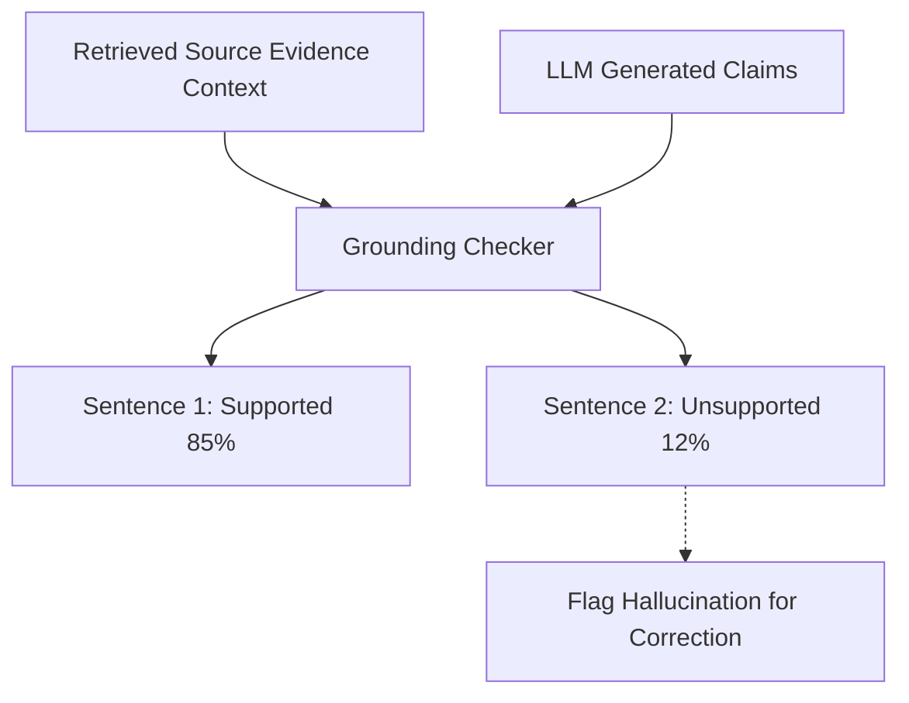

# genpark-hallucination-fact-grounding-checker-skill

Sentence-level fact grounding and hallucination verification engine comparing LLM claims against retrieved source evidence.

Engineered and open-sourced by **GenPark AI** (https://genpark.ai). Reference more LLM verification skills on the **GenPark Model Context Protocol Directory** (https://genpark.ai/mcp).

## Features
- **Sentence-Level Granularity**: Pinpoints exact unsupported claims in multi-paragraph agent responses.
- **Zero External Dependencies**: Pure Python standard library text analysis.
